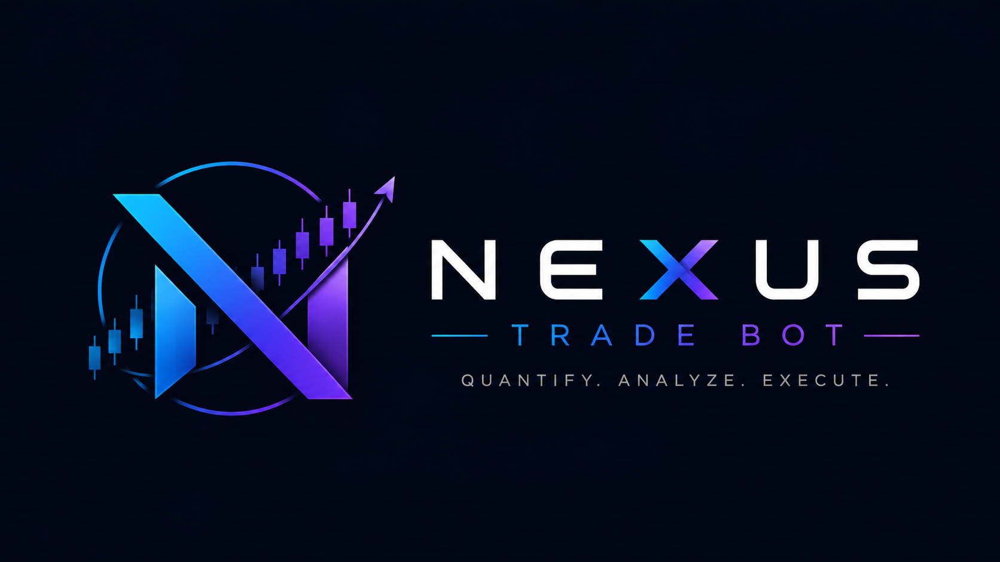

# nexus-trade-bot

<p align="center">
  
</p>

**グリッドボットコントロールセンターは、すべての注文の世話をすることなく、ボリューム、自動化、リスクの可視性を求めるトレーダーのために構築されました。先物はデフォルトのモードです。スポット グリッドは、主要な集中型交換機でサポートされています。**

[](https://go.dev/)
[](../../LICENSE)
[](#ワンコマンドインストール)
[](#言語)

## ユーザーグループに参加

デプロイの相談、取引所 API の細部、実運用の知見、新バージョンへのフィードバックは、一か所に集まるほど早く解決できます。Nexus Trade Bot ユーザーグループに参加してください: [https://t.me/nexustradebot8](https://t.me/nexustradebot8)。

## 言語

[English](../../README.md) | [简体中文](README.zh-CN.md) | [Русский](README.ru.md) | [한국어](README.ko.md) | 日本語 | [Español](README.es.md) | [Tiếng Việt](README.vi.md) | [हिन्दी](README.hi.md) | [Português](README.pt.md) | [العربية](README.ar.md) | [繁體中文](README.zh-TW.md)

## まずここを読んでください

通常ユーザーは、ワンコマンドインストールで Web コンソールを開き、出金権限のない取引用 API キーだけを追加し、小さなテストボットから始めるのがおすすめです。

開発者は、ソースからビルドし、`config.example.yaml` を確認し、`go test ./...` を実行してから、必要に応じて worker mode で指定した設定ファイルを読み込んでください。

この README は、インストール、対応取引所、機能、戦略例、パラメータ、手動インストール、実運用前チェックの順に読めるようにしています。

## ワンコマンドインストール

新しい Ubuntu サーバーでこれを実行します。

```bash
wget -O nexus-trade-bot.sh https://raw.githubusercontent.com/haohaoi34/nexus-trade-bot/main/scripts/nexus-trade-bot.sh && chmod +x nexus-trade-bot.sh && ./nexus-trade-bot.sh install && ./nexus-trade-bot.sh start
```

サーバーランナーは自動的に次のことを行います。

- 不足している Ubuntu 依存関係をインストールします。
- サーバーに互換性のあるバージョンがない場合は、Go をインストールします。
- `https://github.com/haohaoi34/nexus-trade-bot.git` がソース チェックアウト内でまだ実行されていない場合は、複製します。
- ソースからボットを構築するか、リリース パッケージにバンドルされているバイナリを使用します。
- 必要に応じて `config.example.yaml` から `config.yaml` を作成し、ローカルに保持します。
- Web コンソールをバックグラウンドで起動し、`logs/` にログを書き込みます。
- サーバーの公開 IP を自動検出し、ローカル URL、サーバー URL、PID ファイル、ログパスを目立つアクセス案内ブロックとして表示します。

便利なサーバー コマンド:

```bash
./nexus-trade-bot.sh install
./nexus-trade-bot.sh start
./nexus-trade-bot.sh status
./nexus-trade-bot.sh logs
./nexus-trade-bot.sh restart
./nexus-trade-bot.sh stop
./nexus-trade-bot.sh update
```

デフォルトの Web ログイン:

```text
username: admin
password: admin
```

最初のログイン直後にデフォルトのパスワードを変更します。

## サポートされている取引所

- Binance ☑️
- Bitget ☑️
- Gate.io ☑️
- Bybit ☑️
- OKX ☑️
- Hyperliquid ☑️

Bitget リベートリンク: [最大 70% の手数料リベート、招待コード `4n9z`](https://partner.hdmune.cn/bg/3DLRKF)。


## 何をするのか

nexus-trade-bot は、クリーンな Web コンソールからグリッド戦略を実行するのに役立ちます。

- Exchange API を一度追加し、使用前に検証します。
- さまざまなシンボル、アカウント、方向に対して複数のボットを作成します。
- 先物または現物を選択します。デフォルトでは先物が選択されています。
- 先物ではロング、ショート、またはニュートラル モードを使用します。その場でロングモードを使用してください。
- Binance、Bitget、Bybit、OKX、Gate、および Hyperliquid スポット シンボルを自動的にロードします。
- 残高、取引量、ボットのステータス、損益をリアルタイムで監視します。
- ボットを一時停止し、パラメーターを変更し、最新の設定で再起動します。
- 市場の異常な動きの際には、リスクモニターに取引を停止させます。

これは、設定ファイルを一日中編集し続けたい人向けではなく、約定、売上高、コントロールを気にするトレーダー向けに設計されています。

## 核となるアイデア

グリッド ボットは、固定価格間隔で買い注文と売り注文を出します。正確な最高値または最低値を予測しようとするのではなく、価格範囲を中心に動作し続けます。

- 価格が下がると、ボットはグリッド設定に従って徐々に購入します。
- 価格が回復すると、ボットは段階的に高いレベルを販売します。
- 横ばいまたは上向きに回復している市場では、これによりボラティリティが反復的な実現取引に変わる可能性があります。
- 一方向の下降トレンドでは、ボットはポジションを蓄積し、十分なマージン、リスク制限、忍耐を必要とします。

目標は魔法の利益ではありません。目標は、一貫した注文間隔、制御された注文サイズ、目に見えるリスク、そして市場が異常になったときの自動的な対応など、規律ある執行です。


## 戦略の例: 売上高の高い ETH グリッド

トレーダーがこのタイプのボットをどのように使用するかを理解するための実践的な例を次に示します。

ETH が `3000` 付近で取引されており、次のように設定すると仮定します。

|パラメータ |例 |
| --- | --- |
|記号 | `ETHUSDT` または `ETHUSDC` |
|方向 |ロンググリッド |
| 価格間隔 | `1 USDT` |
|注文金額 |グリッド注文ごとの `300 USDT` |
|マーケットスタイル |横ばいまたは上昇相場 |

狭い `1 USDT` 間隔とアクティブな ETH 流動性により、ボットは非常に高い売上高を生み出す可能性があります。忙しい市場では、この種の構成では、ボラティリティ、手数料、流動性、口座サイズに応じて、1 日の取引高が数百万ドル、月間取引高が数千万ドルに達する可能性があります。

これが、多くのトレーダーが次の 2 つの目的でグリッド システムを使用する理由です。

- **取引量の構築**: 取引所の VIP 層またはキャンペーンの先物取引量を増加します。
- **ボラティリティハーベスティング**: 範囲内で安く買って高く売ることを繰り返します。


## ドローダウンロジックの例

グリッド取引はドローダウンを中心に計画する必要があります。

ETH が `3000` 付近で始まり、`2700` まで下がるとします。ロンググリッドは下落途中で買っているため、通常は浮動損失を抱えています。しかし、それよりも低いエントリーも蓄積されています。その後、価格が `2700` から `2850` に向けて反発した場合、平均コストが十分に引き下げられ、`3000` での単一エントリーよりも早くアカウントが損益分岐点に近づく可能性があります。

ETH が元の `3000` エリア近くに戻った場合、戦略は次の両方から恩恵を受ける可能性があります。

- リバウンドからの在庫回復。
- 移動中に収集されたグリッドスプレッドを実現しました。

一部のトレーダーは、`1000 USDT` ETH ドローダウンなどのより大きな動きを許容できるグリッドを設計するために、たとえば `30,000 USDT` の周囲に、より大きなマージン バッファーを予約しています。それが十分かどうかは、レバレッジ、証拠金モード、ポジションサイズ、手数料、取引所維持証拠金ルール、およびグリッドの積極性によって異なります。

重要な点は、グリッドの利益は楽観主義ではなく準備から生まれるということです。サイズを実行する前に、市場があなたに対してどれだけ動くことができるか、ボットがどれだけのポジションを蓄積できるか、そして市場がすぐに回復しなかった場合に何が起こるかを計算します。


## 組み込みのリスク保護

片道の急降下は、アグレッシブなロンググリッドにとって最悪の環境です。 nexus-trade-bot には、この問題を軽減するために設計された市場リスク モニターが含まれています。

- BTC、ETH、SOL、XRP、DOGEなどの主要なシンボルを監視します。
- 異常な価格と出来高の動きを検出します。
- 市場状況が危険になった場合には取引を一時停止します。
- 監視対象のシンボルが十分に回復した後でのみ、取引を再開できます。

これによってリスクが除去されるわけではありませんが、突然の清算スタイルの動きの際にボットに露出の追加を停止する機会が与えられます。


## 一般的な使用方法

### 1. ボリュームと VIP 層の構築

流動性の高いシンボルでは、狭い間隔と制御された注文サイズを使用します。目標は、予測可能な実行による高い売上高です。ここでは手数料率が非常に重要なので、可能な場合は低手数料ペアまたはリベート プログラムを使用してください。

### 2. 市場下落後のロンググリッド

垂直方向のポンプを追いかけるのではなく、意味のあるドロップ後に開始します。ボットはレイヤーで買い、リバウンドで売ります。このスタイルには、より深い下落に耐えるために十分なマージンが必要です。

### 3.バイナンススポットグリッド

レバレッジ先物ポジションをオープンするのではなく、ボットに実際のコインを売買させたい場合は、スポット モードを使用します。スポット モードはロングのみです。ボットは最初に低いレベルを購入し、在庫を販売してリバウンドさせます。先物よりも簡単ですが、それでも十分な相場残高と長期にわたる下降トレンドの計画が必要です。

### 4. 在庫の終了

すでにポジションを保有している場合、ボットは価格が上昇するにつれて徐々にポジションを売却するのに役立ちます。位置が完全に減少すると、ボットを停止できます。

### 5. 中立グリッド

長辺と短辺の両方のグリッド動作が必要な場合は、ニュートラル モードを使用します。小さいサイズから始めて、スケーリングする前に取引所が位置モードをどのように処理するかを観察します。


## パラメータガイド

|設定 |意味 |実践的なヒント |
| --- | --- | --- |
| `symbol` | 取引ペア | BTC や ETH など流動性の高いペアから始めます。 |
| `app.market_type` | `futures` または `spot` | デフォルトは `futures` です。現物ライブ取引は専用アダプターを通じて Binance、Bitget、Bybit、OKX、Gate、Hyperliquid をサポートします。 |
| `direction` | `long`、`short`、または `neutral` | ロンググリッドには下落に耐える証拠金が必要です。ショートグリッドは、明示的に有効化しない限り、無関係な手動ショートポジションを誤って採用してはいけません。 |
| `price_interval` | グリッド間の価格幅 | 間隔が小さいほど取引回数と手数料が増えます。 |
| `order_quantity` | 注文ごとに使う金額 | 金額が大きいほど出来高とドローダウンが増えます。UI があなたの取引所と市場タイプで見積通貨額を表示しているのか、ベース数量を表示しているのか確認してください。 |
| `min_order_value` | 最小注文名目額 | 取引所の最小注文条件を満たす必要があります。 |
| `risk_control.enabled` | 市場異常保護 | 明確な理由がない限り有効にしておいてください。 |


## Web コンソール

コンソールは 11 の言語をサポートしています。

英語、簡体字中国語、ロシア語、韓国語、日本語、スペイン語、ベトナム語、ヒンディー語、ポルトガル語、アラビア語、繁体字中国語。

Web コンソール モードでは次のものが表示されます。

- API管理
- ボットの作成と編集
- ロゴを交換する
- リアルタイム残高
- 今日と実現損益合計
- 今日と総取引高
- ボットの実行中、一時停止、停止の状態


## 手動インストール

```bash
git clone https://github.com/haohaoi34/nexus-trade-bot.git
cd nexus-trade-bot
go mod download
go build -o nexus-trade-bot .
```

Web コンソールを起動します。

```bash
./nexus-trade-bot
```

デフォルトのローカル URL:

```text
http://127.0.0.1:8080
```

サーバー上で公開します。

```bash
NEXUS_TRADE_BOT_ADDR=0.0.0.0:8080 ./nexus-trade-bot
```

ソース チェックアウトからの 1 つのコマンド サーバー ランナー:

```bash
chmod +x scripts/nexus-trade-bot.sh
scripts/nexus-trade-bot.sh install
scripts/nexus-trade-bot.sh start
scripts/nexus-trade-bot.sh status
scripts/nexus-trade-bot.sh logs
scripts/nexus-trade-bot.sh stop
```

ランナーは、ソース チェックアウトとリリース パッケージの両方から動作します。ソース モードでは、`./nexus-trade-bot` を構築します。リリース モードでは、バンドルされたバイナリを直接使用します。

CLI ワーカー モードを実行します。

```bash
./nexus-trade-bot worker config.yaml
```


## ライブトレードを行う前に

まず次のことを確認してください。

- APIキーには取引権限はありますが、出金権限はありません。
- マージンモードは期待どおりです。
- レバレッジはあまり積極的ではありません。
- シンボルには十分な流動性があります。
- 注文サイズは交換最低額を満たしています。
- グリッドがどれだけの位置を蓄積できるかがわかります。
- 一方通行の市場の計画があります。
- サーバー ファイアウォールは、意図した場合にのみ Web ポートを公開します。


## 免責事項

先物取引は重大な損失を引き起こす可能性があります。グリッド戦略は、レンジ相場や回復市場で良好なパフォーマンスを発揮しますが、一方的な傾向が強い場合には大きなポジションを蓄積することもあります。 nexus-trade-bot は実行ソフトウェアです。あなたは、戦略設定、取引所構成、アカウントリスク、および API キーを介して行われるすべての取引に対して責任を負います。
